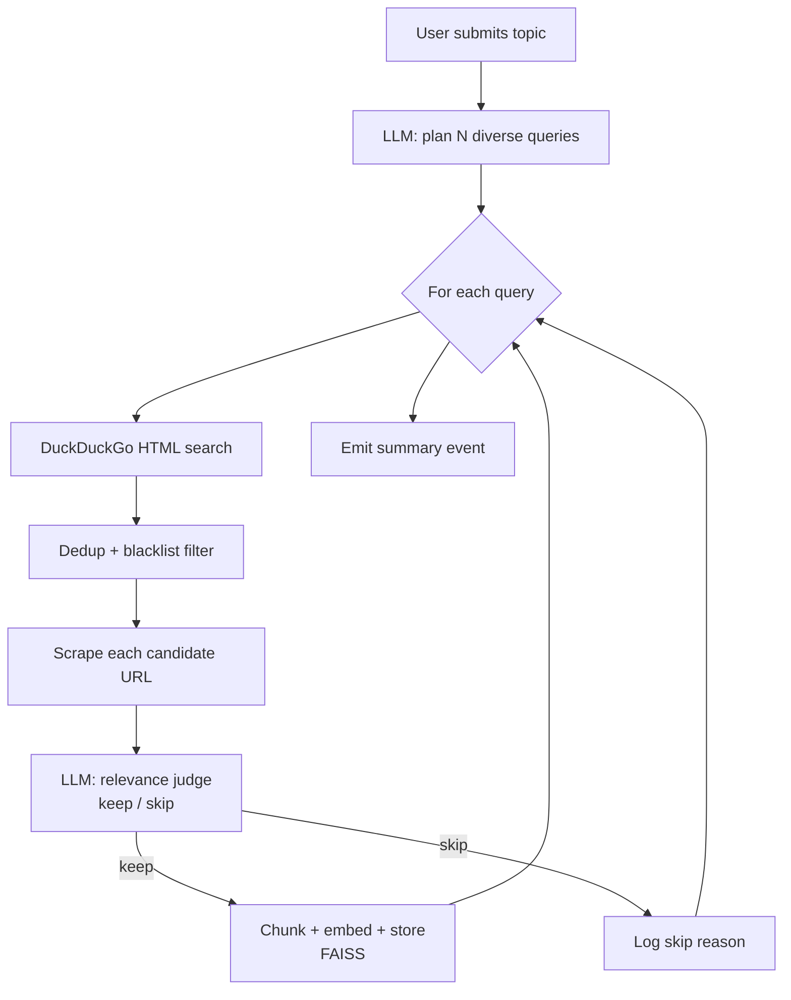

# Autonomous Research Agent

This is the project's **beyond-scope** capability. The rubric requires
*at least two* of five Gen AI components; DocuMind implements three
(Prompt Engineering, RAG, Synthetic Data) and then takes a further step
the rubric does not ask for: an agent that turns a natural-language
topic into a self-expanding knowledge base with **no URLs from the
user**.

## Motivation

RAG systems are only as good as their knowledge base, and curating a
knowledge base by hand is tedious. The research agent automates
curation — the user types a topic, the agent decides what to read, the
knowledge base grows in minutes.

## The Loop



## Components

| File                                 | Role                                                        |
| ------------------------------------ | ----------------------------------------------------------- |
| `app/services/search.py`             | DuckDuckGo HTML search; resolves wrapped links              |
| `app/services/agent.py`              | Orchestration loop; yields progress events                  |
| `app/prompts/templates.py`           | `AGENT_PLANNER_SYSTEM`, `RELEVANCE_JUDGE_SYSTEM`            |
| `app/routers/agent.py`               | `POST /agent/research`, `GET /agent/stream` (SSE)           |
| `frontend/src/pages/AgentPage.jsx`   | Live event timeline, summary card, topic input              |

## Search

We **do not require an API key**. The agent POSTs to
`https://html.duckduckgo.com/html/`, which returns a static HTML result
list, and parses it with BeautifulSoup. Outbound links are wrapped in
`/l/?uddg=<url>` and we unwrap them via `urllib.parse`.

### Blacklist

Domains that either block bots or lack text content are skipped at the
search step:

- Video: `youtube.com`, `vimeo.com`, `tiktok.com`
- Social: `x.com`, `twitter.com`, `facebook.com`, `instagram.com`,
  `linkedin.com`, `pinterest.com`, `reddit.com`
- Binary extensions: `.pdf`, `.zip`, `.doc(x)`, `.ppt(x)`, `.xls(x)`,
  `.mp4`, `.mp3`, `.mov`, `.avi`

`is_blacklisted()` checks host lowercase match and extension regex.
Covered by a dedicated test (`test_search_url_unwrap_and_blacklist_helpers`).

## Planning

`AGENT_PLANNER_SYSTEM` asks the LLM to produce **N diverse search
queries** with priority-ordered constraints:

1. Queries must be diverse (different angles, not paraphrases).
2. Prefer queries likely to hit authoritative docs.
3. Each query ≤12 words.
4. Output strict JSON `{"queries": ["...", "..."]}`.

A regex-fallback parser recovers the JSON if the model adds stray
prose.

In stub mode the planner returns deterministic variants
(`{topic}`, `{topic} tutorial`, `{topic} official documentation`, …),
so the downstream search/scrape still exercises real network code.

## Relevance Judging

For each scraped page we call the LLM with `RELEVANCE_JUDGE_SYSTEM`,
which enforces a strict JSON contract:

```json
{"decision": "keep" | "skip", "reason": "one short sentence"}
```

The judge sees the topic, page title, search snippet, and the first
1500 characters of the cleaned body — enough signal, cheap on tokens.
A conservative default (skip) is applied if the JSON can't be parsed
at all.

Criteria for "keep":

- Directly relevant to the topic.
- Contains substantive technical content.
- In English.
- Not a login wall, 404, cookie banner, or ad-heavy landing page.

## Deduplication

Before scraping, the agent pulls the existing knowledge-base URLs from
`VectorStore.list_documents()` and tracks them in a `seen` set. A
second run on the same topic produces `skip` events rather than
re-ingesting pages. This is explicitly covered by a test
(`test_agent_deduplicates_existing_sources`).

## Streaming Protocol

`GET /api/agent/stream` emits Server-Sent Events (one JSON object per
`data:` line):

| Event            | Payload                                                       |
| ---------------- | ------------------------------------------------------------- |
| `start`          | `{topic, num_queries, per_query}`                             |
| `plan`           | `{queries: [...]}`                                            |
| `search_start`   | `{iter, query}`                                               |
| `search_results` | `{query, urls: [{url, title, snippet}, ...]}`                 |
| `scrape_start`   | `{url, title}`                                                |
| `scrape_done`    | `{url, chars, title}`                                         |
| `scrape_failed`  | `{url, reason}`                                               |
| `judge`          | `{url, decision, reason}`                                     |
| `ingest`         | `{url, title, chunks, doc_id}`                                |
| `ingest_failed`  | `{url, reason}`                                               |
| `skip`           | `{url, reason}`                                               |
| `done`           | `{summary: {topic, queries, scraped, ingested, skipped, ...}}`|
| `error`          | `{message}`                                                   |

The React page consumes this with `EventSource`.

## Example Run (Real, No API Key)

Topic: `"FastAPI framework"`, 1 query, 2 results per query.

The agent autonomously:

1. **Planned** the query `"FastAPI official documentation"`.
2. **Searched** DuckDuckGo → 4 results.
3. **Scraped** `https://fastapi.tiangolo.com/` (13,734 chars).
4. **Judged** as keep: *"Directly relevant and contains substantive
   technical content about FastAPI."*
5. **Ingested** 21 chunks.
6. **Scraped** `https://fastapi-tutorial.readthedocs.io/en/latest/`
   (46,859 chars).
7. **Judged** as keep.
8. **Ingested** 84 chunks.
9. **Done**: 2 documents, **105 chunks, 9.8 seconds**, zero URLs
   provided by the user.

## Operational Limits

- Max 5 queries per run × 5 results per query (hard-coded in
  `ResearchConfig`; enforced at the Pydantic layer).
- Per-page scrape timeout: `REQUEST_TIMEOUT` (default 30 s).
- Per-scrape character cap for the judge prompt: 1500 chars.
- No recursion / link-following: one hop only, one topic per run.
  Keeps it simple and auditable.

## Why This Matters (for the Rubric)

The agent demonstrates:

- **Technical innovation**: combines prompt engineering, planning,
  search, scraping, and RAG ingestion into a single coherent workflow.
- **Creative application**: traditional RAG requires manual KB
  curation — this removes that friction.
- **Real-time UX**: SSE streaming gives the user a live, auditable
  picture of every decision the LLM makes.
- **Robustness**: dedup, blacklist, scrape failure handling, conservative
  defaults on JSON parse errors.

## Safety Notes

- The scraper identifies itself with a browser User-Agent and respects
  HTTP timeouts. It does **not** honour robots.txt — do not point it
  at sites you do not own or have explicit authorization to crawl.
- Every ingested page has its source URL stored alongside it, so every
  answer that cites the page can link back to the original.
- The blacklist and relevance judge combine to keep anti-bot domains
  and low-quality pages out. They are not perfect; audit the knowledge
  base periodically with the "Clear All" button.
