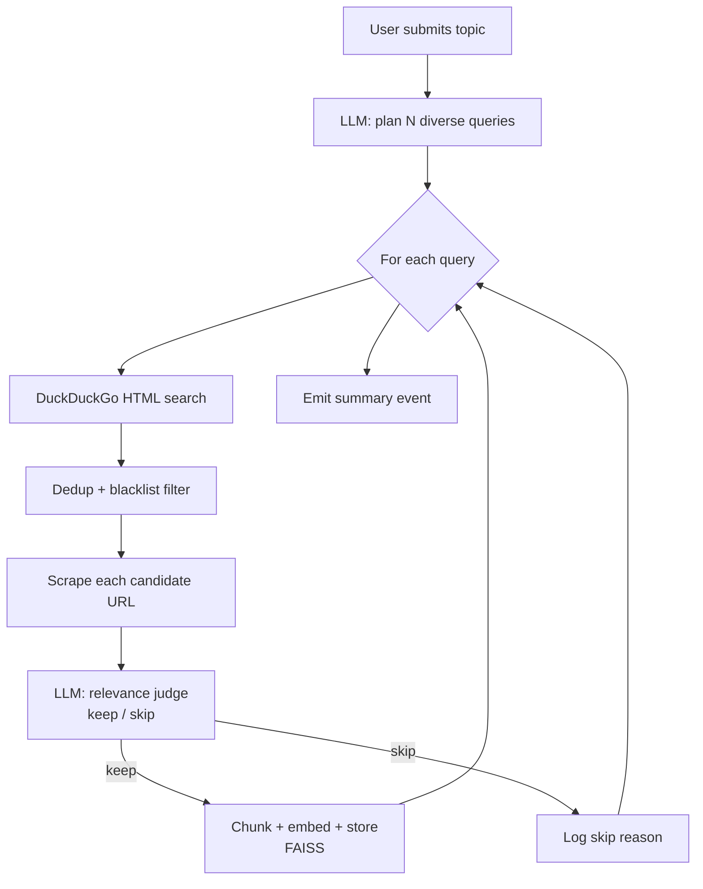

# Autonomous Research Agent

The agent turns a natural-language topic into a self-expanding knowledge base
— **no URLs required**. It plans, searches, scrapes, judges, and ingests
without human intervention.

## The Loop



## Components

| File                                 | Role                                                        |
| ------------------------------------ | ----------------------------------------------------------- |
| `app/services/search.py`             | DuckDuckGo HTML search; resolves wrapped links              |
| `app/services/agent.py`              | Orchestration loop; yields progress events                  |
| `app/prompts/templates.py`           | `AGENT_PLANNER_SYSTEM`, `RELEVANCE_JUDGE_SYSTEM`            |
| `app/routers/agent.py`               | `POST /agent/research`, `GET /agent/stream` (SSE)           |
| `frontend/src/pages/AgentPage.jsx`   | Live event timeline + summary card                          |

## Search

We **do not require an API key**. The agent POSTs to
`https://html.duckduckgo.com/html/`, which returns a static HTML result list,
and parses it with BeautifulSoup. Outbound links are wrapped in
`/l/?uddg=<url>` and we unwrap them.

### Blacklist

Domains that either block bots or lack text content are skipped at the
search step:

- Video: `youtube.com`, `vimeo.com`, `tiktok.com`
- Social: `x.com`, `twitter.com`, `facebook.com`, `instagram.com`,
  `linkedin.com`, `pinterest.com`, `reddit.com`
- Binary extensions: `.pdf`, `.zip`, `.doc(x)`, `.ppt(x)`, `.xls(x)`,
  `.mp4`, `.mp3`, `.mov`, `.avi`

## Planning

`AGENT_PLANNER_SYSTEM` asks the LLM to produce **N diverse search queries**
with priority-ordered constraints:

1. Queries must be diverse (different angles, not paraphrases).
2. Prefer queries likely to hit authoritative docs.
3. Each query ≤ 12 words.
4. Output strict JSON `{"queries": ["...", "..."]}`.

A regex-fallback parser recovers the JSON if the model adds stray prose.

## Relevance Judging

For each scraped page we call the LLM with `RELEVANCE_JUDGE_SYSTEM`, which
enforces a strict JSON contract:

```json
{"decision": "keep" | "skip", "reason": "one short sentence"}
```

The judge sees the topic, page title, search snippet, and the first 1500
characters of the cleaned body — enough signal, cheap on tokens.

## Deduplication

Before scraping, the agent pulls the existing knowledge-base URLs from
`VectorStore.list_documents()` and tracks them in a `seen` set. A second run
on the same topic produces `skip` events rather than re-ingesting pages.

## Streaming Protocol

`GET /api/agent/stream` emits Server-Sent Events (one JSON object per
`data:` line):

| Event            | Payload                                                       |
| ---------------- | ------------------------------------------------------------- |
| `start`          | `{topic, num_queries, per_query}`                             |
| `plan`           | `{queries: [...]}`                                            |
| `search_start`   | `{iter, query}`                                               |
| `search_results` | `{query, urls: [{url, title, snippet}, ...]}`                 |
| `scrape_start`   | `{url, title}`                                                |
| `scrape_done`    | `{url, chars, title}`                                         |
| `scrape_failed`  | `{url, reason}`                                               |
| `judge`          | `{url, decision, reason}`                                     |
| `ingest`         | `{url, title, chunks, doc_id}`                                |
| `ingest_failed`  | `{url, reason}`                                               |
| `skip`           | `{url, reason}`                                               |
| `done`           | `{summary: {topic, queries, scraped, ingested, skipped, ...}}`|
| `error`          | `{message}`                                                   |

The React page consumes this with `EventSource`.

## Stub Mode

With `OPENAI_API_KEY` unset, the agent still runs end-to-end:

- **Planner** returns topic variants (`topic`, `topic tutorial`, `topic
  official documentation`, …).
- **Judge** keeps any page with ≥ 400 characters of extracted text.
- **Search and scrape** use real HTTP — so you actually see real sites
  being crawled and ingested. Only the LLM decisions are stubbed.

This lets the agent be demoed without an API key while still proving the
network and pipeline code works.

## Operational Limits

- Max 5 queries per run and 5 results per query (hard-coded in
  `ResearchConfig`).
- Per-page scrape timeout: `REQUEST_TIMEOUT` (default 30 s).
- Per-scrape character cap for the judge prompt: 1500 chars.
- No recursion / link-following: one hop only, one topic per run. Keep
  it simple, keep it auditable.

## Example Run

```
$ curl -N "http://localhost:8000/api/agent/stream?topic=FastAPI%20framework&num_queries=1&per_query=2"

data: {"type": "start", "topic": "FastAPI framework", ...}
data: {"type": "plan", "queries": ["FastAPI official documentation"]}
data: {"type": "search_start", "query": "FastAPI official documentation"}
data: {"type": "search_results", "query": "...", "urls": [4 results]}
data: {"type": "scrape_start", "url": "https://fastapi.tiangolo.com/"}
data: {"type": "scrape_done", "url": "...", "chars": 13734}
data: {"type": "judge", "decision": "keep", "reason": "Directly relevant..."}
data: {"type": "ingest", "chunks": 21}
data: {"type": "scrape_start", "url": "https://fastapi-tutorial.readthedocs.io/..."}
data: {"type": "scrape_done", "chars": 46859}
data: {"type": "judge", "decision": "keep"}
data: {"type": "ingest", "chunks": 84}
data: {"type": "done", "summary": {"ingested": 2, "total_chunks": 105, "elapsed_ms": 9854.1}}
```

## Safety Notes

- The scraper identifies itself with a browser User-Agent. It does not
  honor robots.txt — do not point it at sites you do not own or have
  not been explicitly authorized to crawl.
- Every ingested page has its source URL stored alongside it, so every
  answer that cites the page can link back to the original.
- The blacklist and relevance judge combine to keep anti-bot domains and
  low-quality pages out. They are not perfect; audit the knowledge base
  periodically.
