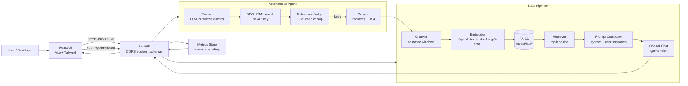
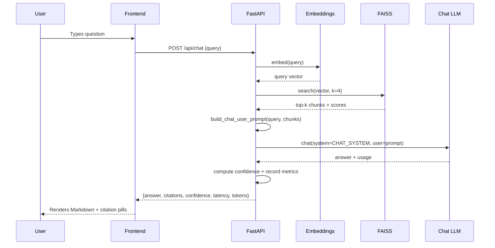
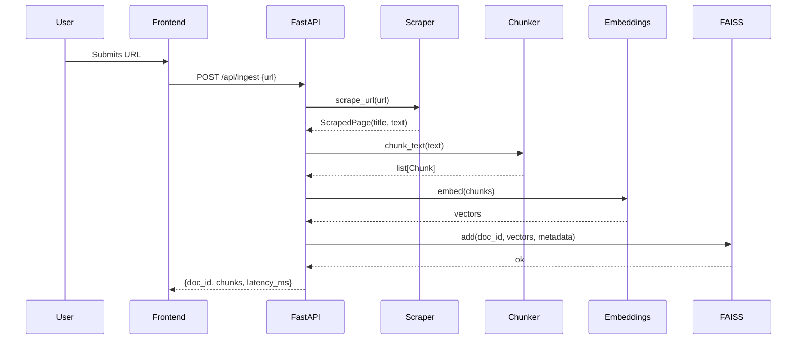

# Architecture

## High-Level View

## Request Sequence — Chat

## Request Sequence — Ingestion

## Module Responsibilities

| Module                         | Responsibility                                               |
| ------------------------------ | ------------------------------------------------------------ |
| `app/core/config.py`           | Env-based settings via `pydantic-settings`                   |
| `app/core/metrics.py`          | Thread-safe rolling metrics                                  |
| `app/services/llm.py`          | OpenAI wrapper with retries + stub-mode fallback             |
| `app/services/search.py`       | DuckDuckGo HTML search, link unwrap, blacklist filter         |
| `app/services/agent.py`        | Autonomous research loop (plan → search → scrape → judge → ingest) |
| `app/services/scraper.py`      | Fetch + clean HTML (strips scripts, nav, footer, etc.)       |
| `app/services/chunker.py`      | Paragraph + heading-aware semantic chunking with overlap     |
| `app/services/vector_store.py` | FAISS index + JSON metadata, disk-persisted                  |
| `app/services/rag.py`          | End-to-end RAG: ingest, chat, generate-docs, synthetic       |
| `app/prompts/templates.py`     | System and user prompt builders                              |
| `app/routers/*`                | Thin FastAPI route handlers; validation via `schemas.py`     |
| `frontend/src/pages/*`         | Chat, KB, DocsGen, Synthetic, Metrics                        |
| `frontend/src/components/*`    | Reusable UI primitives (Card, Button, Spinner, Markdown…)    |
