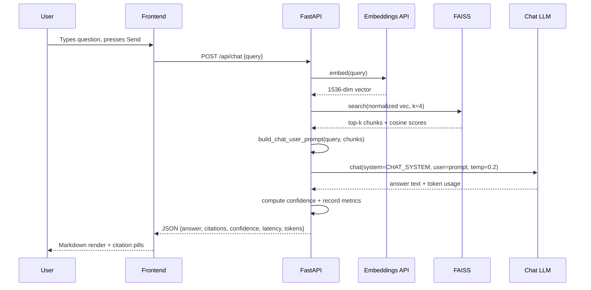
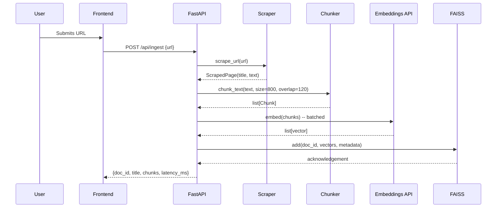
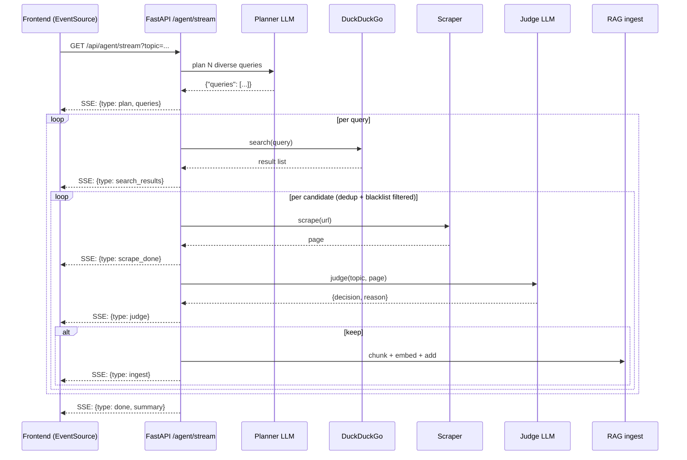

# Architecture

DocuMind is a two-tier application: a FastAPI backend that owns all
LLM, vector-store, and agent logic, and a React/Vite frontend that
renders an Apple-styled dashboard and a live event stream for the
research agent.

## High-Level View

```mermaid
flowchart LR
    U[User / Developer] --> UI[React UI<br/>Vite + Tailwind + Framer Motion]
    UI -->|HTTP/JSON /api/*| API[FastAPI<br/>CORS, routers, schemas]
    UI -->|SSE /agent/stream| API

    subgraph AGENT[Autonomous Research Agent]
        direction TB
        PLAN[Planner<br/>LLM: N diverse queries] --> SRCH[DuckDuckGo HTML search<br/>no API key]
        SRCH --> FLT[Filter<br/>blacklist + dedupe]
        FLT --> SCR[Scraper]
        SCR --> JUDGE[Relevance Judge<br/>LLM: keep or skip]
        JUDGE -->|keep| ING
    end

    subgraph RAG[RAG Pipeline]
        direction TB
        ING[Scraper<br/>requests + BS4] --> CHK[Chunker<br/>paragraph + heading aware]
        CHK --> EMB[Embedder<br/>OpenAI text-embedding-3-small]
        EMB --> VS[(FAISS<br/>IndexFlatIP + JSON meta)]
        VS --> RET[Retriever<br/>top-k cosine]
        RET --> PR[Prompt Composer<br/>system + user templates]
        PR --> LLM[OpenAI Chat<br/>gpt-4o-mini]
    end

    API --> AGENT
    API --> RAG
    API --> MET[Metrics Store<br/>in-memory rolling window]

    LLM --> API
    MET --> API
    API --> UI
```

## Chat Request Sequence

## Ingestion Sequence

## Agent Sequence (Beyond Scope)

## Module Responsibilities

| Module                         | Responsibility                                                  |
|--------------------------------|-----------------------------------------------------------------|
| `app/core/config.py`           | Env-loaded settings via `pydantic-settings`                     |
| `app/core/metrics.py`          | Thread-safe rolling metrics window (200 events) + counters      |
| `app/core/logging.py`          | Minimal structured logger                                       |
| `app/services/llm.py`          | OpenAI wrapper with tenacity retries + stub-mode fallback       |
| `app/services/search.py`       | DuckDuckGo HTML search, link unwrap, blacklist filter           |
| `app/services/agent.py`        | Autonomous research loop (plan → search → scrape → judge → ingest) |
| `app/services/scraper.py`      | Fetch + clean HTML (strips scripts, nav, footer, ads, etc.)     |
| `app/services/chunker.py`      | Paragraph + heading-aware semantic chunking with tail overlap   |
| `app/services/vector_store.py` | FAISS index + JSON metadata, disk-persisted, thread-safe add    |
| `app/services/rag.py`          | End-to-end RAG: ingest, chat, generate-docs, synthetic          |
| `app/prompts/templates.py`     | 4 system prompts and their user-side builders                   |
| `app/routers/*`                | Thin FastAPI route handlers, validated via `schemas.py`         |
| `frontend/src/pages/*`         | Home, Chat, Agent, KB, DocsGen, Synthetic, Metrics              |
| `frontend/src/components/*`    | Reusable UI primitives (Card, Button, Input, Markdown, Hero…)   |

## Deployment Topology

Local-first. Both services run on the developer's machine:

- Backend on port **8000** (Uvicorn with hot reload).
- Frontend on port **5173** (Vite dev server). Vite's `server.proxy`
  forwards `/api/*` to the backend, so the React bundle makes
  same-origin requests — no CORS gymnastics in development.

For production: any WSGI/ASGI host (uvicorn behind Nginx, AWS App
Runner, Fly, Render), a persistent volume mounted at
`data/vector_store/`, and the React bundle served statically.

## Request Lifetimes and Timeouts

| Path                      | Typical | Notes                                                    |
|---------------------------|---------|----------------------------------------------------------|
| `GET /api/health`         | <10 ms  | Pure in-process check                                    |
| `GET /api/metrics`        | <10 ms  | Snapshot of the rolling window                           |
| `POST /api/chat`          | 1–3 s   | 1 embed call + 1 chat call + prompt composition          |
| `POST /api/ingest`        | 1–3 s   | HTTP fetch + parse + chunk + batch embed + index append  |
| `POST /api/generate-docs` | 3–5 s   | Longer output (~1400 max tokens)                          |
| `POST /api/synthetic-data`| 4–7 s   | Full-document source, temperature 0.6, JSON contract      |
| `GET  /api/agent/stream`  | 10–60 s | Bounded by `num_queries × per_query` scrape+judge steps  |

Per-network timeout is **30 s** (scraper + LLM API), configurable via the
`REQUEST_TIMEOUT` env var. OpenAI calls use `tenacity` with exponential
backoff, up to three retries.
